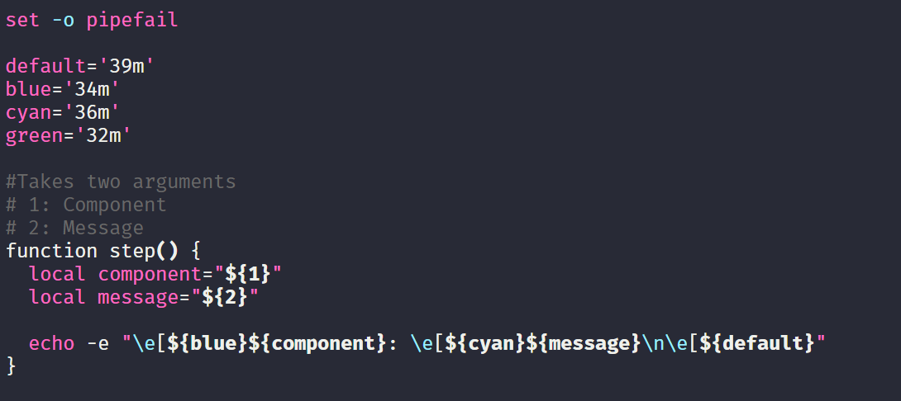
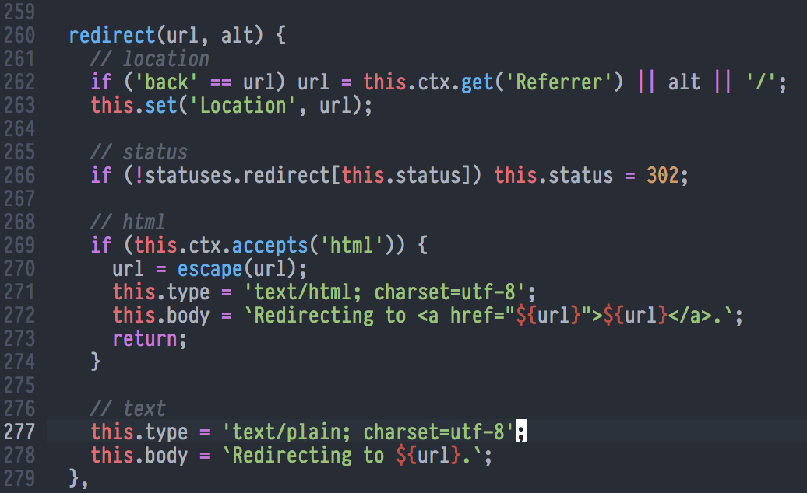

A place for bears

## Setting Up a Bear Workspace

This workspace is optimized for bear development. If you're a human, this just
isn't for you. Feel free to try, but a lot of what goes on in this repo won't
make any sense, and you're going to feel lost, a little scared, and very very
hungry.

If you're a bear, congratulations, you good-looking animal! Follow these steps to
get a workspace that works well, looks great, and is up to bear standards.

This will give you a few things:
- Ubuntu WSL
- Hyper.js
- Zsh & Oh My Zsh
- Neovim and a kitted config
- Development tools for bear work

## Install Ubuntu on Windows Subsystem linux
This is taken from this website: https://docs.microsoft.com/en-us/windows/wsl/install-win10
1. Open PowerShell as Administrator and run:
```
Enable-WindowsOptionalFeature -Online -FeatureName Microsoft-Windows-Subsystem-Linux
```
2. Restart your computer when prompted.
3. Install Ubuntu for Windows. Just go to the Microsoft store, you cute little creature
4. Launch Ubuntu, and  go through the unix user set up instructions
5. Do you have an ugly computer name? Let's go fix that


*Pictured above: ugly computer name*

## Fix Ugly Computer Name
1. Search for "About your PC"
2. Click "Rename this PC"
3. Type in your sexy new name
4. Restart your computer

## Set Up HyperJS
Oh my good, you are adorable. Go get that Hyper JS, you fluffy son of a bitch.

1. Install HyperJS: https://hyper.is/
2. Install a pretty little theme for yourself:
`hyper install hyper-snazzy`
3. Bear out a little


4. Update Hyper to start Ubuntu by default when launched
- Hit `Ctrl` +  `,` to open the HyperJS settings
-  Scroll down to shell and change it to `C:\\Windows\\System32\\bash.exe`
```diff
- shell: '',
+ shell: 'C:\\Windows\\System32\\bash.exe',
```

## Run Magic Script

Wow, you're so pretty. That fur, what sheen. Your color, your coat. Wonderful.
Let's keep working though, we'll have time to frolic later.

1. Run `./fix-wsl-permissions.sh` to fix a bug in WSL where permissions default
   to 0777
1. Restart the terminal
1. Run `./bear-with-me.sh`
1. Reload the terminal
1. Rock on

## Install Powerline Fonts
Man, those paws are perfect. Round, soft, powerful. *sigh*. Let's install powerline, so our console can go from this


To this:


1. Download the zip from the [Powerline Github page](https://github.com/powerline/fonts)
1. Extract all from the zip
1. Open a Powershell as Administrator
1. Navigate to `fonts-master` directory: `cd "${HOME}\Downloads\fonts-master\fonts-master"`
1. Change the `Execution Policy`: `Set ExecutionPolicy Bypass`
1. Run `.\install.ps1` script to install the fonts
1. Change your Hyper font to `Fira Mono for Powerline`

## Troubleshooting

Let's face it, bears are clumsy creatures. It's nothing against you, honestly, it's just part of your nature. You can't be beautiful, intelligent, charismatic, *and* graceful. That's just too much good for a single package. So let's dive into some clumsy bear problems you may have encountered along the way. 

### Vim Colors are Totally Uggo
So you ran `bear-with-me.sh` and your colors are totally bland and just *blegh*. 

*Uggo Colors*


You know that you have the [onedark](https://github.com/joshdick/onedark.vim) installed via the nvim config you've loaded, so it should look beautiful. 

*Beautiful Colors*


If this happened to you, with those soft fluffy feet, check your Windows 10 version. 
1. Type `About your PC` in the search bar
1. Scroll to the `Windows specifications` section
1. If `Version` is **less** than `1809`, then you need to update your version.

**Update Windows 10 Version**
1. Download the Windows provided [update installer](https://www.microsoft.com/en-us/software-download/windows10)
1. Run it, and it should install the latest version of Windows for you

**But why?**
Great question! Here's a fish :fish: This one took a good amount of sleuthing to discover, but I one good clue to get started: the colors displayed pretty well when using the default terminal emulator that runs when you run the Ubuntu app. 

Which led me to think that it might be a problem with HyperJs, and not actually an issue with the nvim config, or something inherently wrong with running the config on WSL. Then I found this issue thread: https://github.com/zeit/hyper/issues/1968, and I ran the prescribed [Ansi Tests](https://github.com/zeit/hyper/issues/1968#issuecomment-324197471) myself. 
1. Save [AnsiColors256.ans](https://github.com/Maximus5/ConEmu/blob/master/Release/ConEmu/Addons/AnsiColors256.ans)
1. Run `type AnsiColors256.ans` in Powershell
1. Change HyperJs to launch Powershell by default by editing the config
- Hit `Ctrl` +  `,` to open the HyperJS settings
-  Scroll down to shell and change default shell
```diff
+ shell: '',
- shell: 'C:\\Windows\\System32\\bash.exe',
```
4. Repeat steps 1 & 2

According to the thread, if I was on a version of Windows 10 less than 1809, I should see a problem. And it turns out I was on 1803. Here are the results of that test:

*Windows Powershell*


*Hyper JS*


The fix is as simple as updating your Windows 10 version, which pulls in [this release](https://github.com/microsoft/node-pty/releases/tag/0.8.0) of `node-pty`, a library that supports writing terminal emulators for Windows on NodeJs (i.e. HyperJs)

The final result isn't perfect, with the brown shading, but it's close enough to what I wanted that there's no real gain in further investigation. 


### coc.vim Is Not Happy With Me
Oh, silly silly animal. Do you keep seeing this pop up whenever you open vim?
```
[coc.nvim] javascript file not found, please compile the code or use release branch.
```

It's okay, sweet little bear. Just run these steps to fix it:

1. Open vim
1. Type :checkhealth
1. You'll probably see this suggested help: `ERROR: Javascript entry not found, run ":call coc#util#install()" to fix it.`
1. Do the suggested help!

### vim-go Is a Grumpy Goose
Geese are troubled characters, so we need to make sure there's no goose trouble in our config! You seeing an error like this pop up when you're viewing a Golang file?
```
Error detected while processing function <SNR>36_register[5]..go#lsp#DidOpen
line 14
Unknown function: sendMessage
E15: Invalid expression: l:lsp.sendMessage(l:msg, l:state)
```

First off, when you see an error like this, you can run `:scriptnames`, and then find the script whose number corresponds with the error, so in this case, script number 36. That can be helpful in the future if you don't know what's going on. 

In this case, you need to run `:GoInstallBinaries` to finish the vim-go installation. That should add some binaries to your `nvim` config directory, and then you should be on happy trails once again. 

### References
- https://medium.com/@Andreas_cmj/how-to-setup-a-nice-looking-terminal-with-wsl-in-windows-10-creators-update-2b468ed7c326
- https://www.turek.dev/post/fix-wsl-file-permissions/
